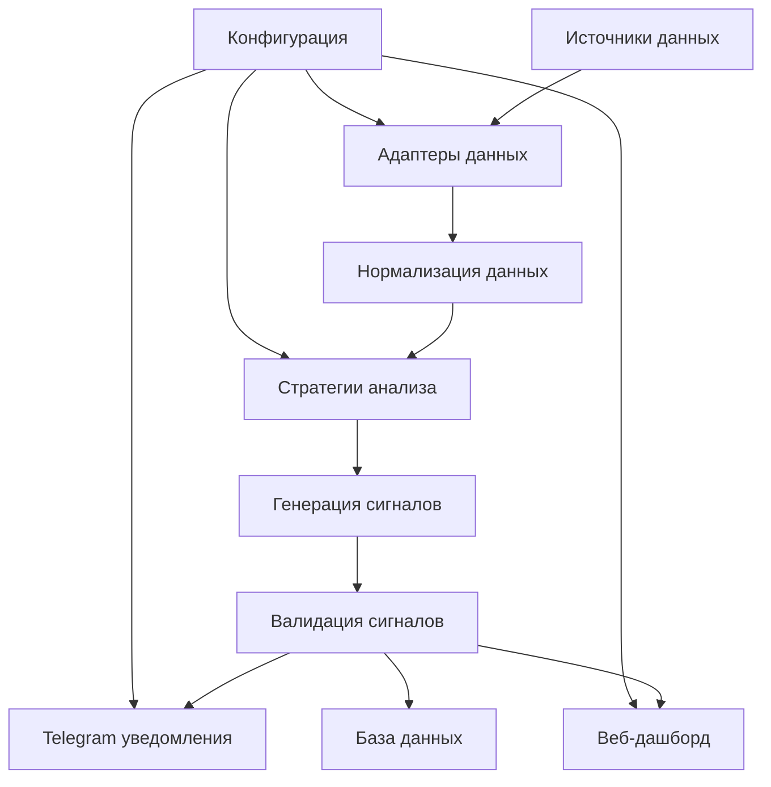

# Архитектура торгового AI-агента

## Обзор системы

Торговый AI-агент представляет собой модульную систему для анализа финансовых рынков и генерации торговых сигналов. Система построена на принципах микросервисной архитектуры с четким разделением ответственности между компонентами.

## Основные компоненты

### 1. Core (Ядро системы)

#### `src/core/config.py`
- Управление конфигурацией системы
- Загрузка настроек из YAML файлов
- Валидация параметров
- Глобальный доступ к настройкам

#### `src/core/logger.py`
- Централизованная система логирования
- Настройка уровней логирования
- Ротация логов
- Форматирование сообщений

### 2. Data Layer (Слой данных)

#### `src/data/base_adapter.py`
- Базовый класс для всех адаптеров данных
- Абстракция для работы с разными источниками
- Нормализация данных в единый формат
- Валидация данных

#### `src/data/fundingpips_adapter.py`
- Адаптер для FundingPips API
- Получение данных форекс/акций
- Обработка исторических данных
- Поддержка WebSocket (планируется)

#### `src/data/hashhedge_adapter.py`
- Адаптер для HashHedge API
- Получение данных криптовалют
- Обработка исторических данных
- Поддержка WebSocket (планируется)

### 3. Strategies Layer (Слой стратегий)

#### `src/strategies/base_strategy.py`
- Базовый класс для всех торговых стратегий
- Определение интерфейса стратегий
- Управление сигналами
- Валидация сигналов

#### `src/strategies/trend_following_strategy.py`
- Стратегия следования за трендом
- Многотаймфреймовый анализ
- Использование технических индикаторов
- Генерация торговых сигналов

#### `src/strategies/indicators.py`
- Расчет технических индикаторов
- Поддержка TA-Lib и собственных реализаций
- RSI, MACD, Bollinger Bands, SMA, EMA и др.
- Валидация данных

### 4. ML Layer (Слой машинного обучения)

#### `src/models/` (планируется)
- Обучение ML моделей
- Предсказания на основе исторических данных
- Валидация моделей
- Сохранение и загрузка моделей

### 5. Communication Layer (Слой коммуникации)

#### `telegram_bot/bot.py`
- Telegram-бот для уведомлений
- Отправка торговых сигналов
- Форматирование сообщений
- Обработка ошибок

### 6. Web Interface (Веб-интерфейс)

#### `app/dashboard.py`
- Streamlit дашборд
- Визуализация данных
- Управление стратегиями
- Мониторинг системы

### 7. Main Application (Основное приложение)

#### `src/main.py`
- Главный класс TradingAgent
- Координация всех компонентов
- Основной цикл работы
- Управление жизненным циклом

## Поток данных



## Архитектурные принципы

### 1. Модульность
- Каждый компонент имеет четко определенную ответственность
- Слабая связанность между модулями
- Высокая когезия внутри модулей

### 2. Расширяемость
- Легкое добавление новых стратегий
- Поддержка новых источников данных
- Гибкая система конфигурации

### 3. Надежность
- Обработка ошибок на всех уровнях
- Логирование всех операций
- Валидация данных

### 4. Производительность
- Асинхронная обработка данных
- Кэширование результатов
- Оптимизация запросов

## Конфигурация

Система использует YAML конфигурацию с иерархической структурой:

```yaml
api:
  fundingpips:
    api_key: "YOUR_API_KEY"
    secret_key: "YOUR_SECRET"
  
trading:
  timeframes: ["4h", "1h", "5m"]
  assets:
    forex: ["EURUSD", "GBPUSD"]
    crypto: ["BTCUSDT", "ETHUSDT"]
  
indicators:
  sma:
    periods: [20, 50, 200]
  rsi:
    period: 14
```

## Развертывание

### Локальная разработка
```bash
make install
make run
```

### Docker
```bash
docker-compose up -d
```

### VPS/Облако
- Поддержка Docker контейнеров
- Автоматический перезапуск
- Мониторинг логов

## Мониторинг и логирование

### Логи
- Структурированное логирование
- Ротация по размеру и времени
- Разные уровни детализации

### Метрики
- Количество сигналов
- Производительность стратегий
- Статус подключений

### Алерты
- Telegram уведомления
- Email уведомления (планируется)
- Системные алерты

## Безопасность

### API ключи
- Хранение в конфигурационных файлах
- Исключение из системы контроля версий
- Шифрование (планируется)

### Валидация данных
- Проверка всех входящих данных
- Санитизация параметров
- Защита от инъекций

## Масштабирование

### Горизонтальное масштабирование
- Разделение по стратегиям
- Разделение по инструментам
- Балансировка нагрузки

### Вертикальное масштабирование
- Увеличение ресурсов сервера
- Оптимизация алгоритмов
- Кэширование данных

## Будущие улучшения

### Краткосрочные
- WebSocket подключения для реального времени
- Дополнительные технические индикаторы
- Улучшенная система бэктестинга

### Среднесрочные
- ML модели для предсказаний
- Автоматическое исполнение сделок
- Продвинутая аналитика

### Долгосрочные
- Микросервисная архитектура
- Kubernetes развертывание
- Машинное обучение с подкреплением

